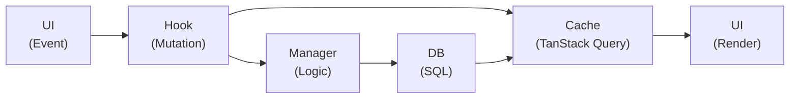
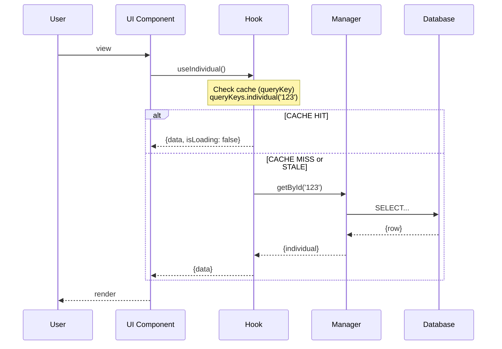
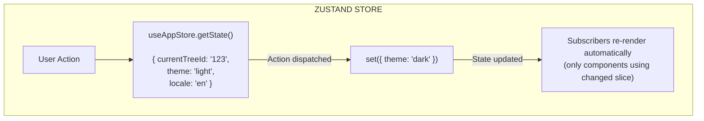

# Data Flow

## General Principle

The application follows a unidirectional data flow with clear separation of responsibilities:



---

## Read Flow (Query)

### Sequence



### Code Example

```typescript
// Component
function IndividualView({ id }: { id: string }) {
  const { data: individual, isLoading, error } = useIndividual(id);

  if (isLoading) return <Loader />;
  if (error) return <Error message={error.message} />;
  if (!individual) return <NotFound />;

  return <PersonCard person={individual} />;
}

// Hook (queryKeys imported from shared module, e.g. $lib/query-keys)
function useIndividual(id: string) {
  return useQuery({
    queryKey: queryKeys.individual(id),
    queryFn: () => IndividualManager.getById(id),
    enabled: !!id,
  });
}

// Manager
class IndividualManager {
  static async getById(id: string): Promise<IndividualWithDetails | null> {
    const individual = await IndividualDB.getById(id);
    if (!individual) return null;

    const names = await NameDB.getByIndividualId(id);
    const birthEvent = await EventDB.getBirthByIndividualId(id);
    const deathEvent = await EventDB.getDeathByIndividualId(id);

    return {
      ...individual,
      primaryName: names.find(n => n.isPrimary) || names[0] || null,
      names,
      birthEvent,
      deathEvent,
    };
  }
}

// Database
class IndividualDB {
  static async getById(id: string): Promise<Individual | null> {
    const db = await getTreeDb();
    const rows = await db.select<RawIndividual[]>(
      'SELECT id, gender, is_living, notes, created_at, updated_at FROM individuals WHERE id = $1',
      [parseEntityId(id)]
    );
    return rows[0] ? mapToIndividual(rows[0]) : null;
  }
}
```

---

## Write Flow (Mutation)

### Sequence


### Code Example

```typescript
// Component
function CreatePersonForm() {
  const createIndividual = useCreateIndividual();
  const navigate = useNavigate();

  const form = useForm<CreateIndividualInput>({
    initialValues: {
      gender: 'U',
      givenNames: '',
      surname: '',
    },
  });

  const handleSubmit = async (values: CreateIndividualInput) => {
    try {
      const newId = await createIndividual.mutateAsync(values);
      showNotification({ message: 'Person created', color: 'green' });
      navigate({ to: '/tree/$treeId/individual/$individualId', params: { individualId: newId } });
    } catch (error) {
      showNotification({ message: 'Error during creation', color: 'red' });
    }
  };

  return (
    <form onSubmit={form.onSubmit(handleSubmit)}>
      {/* ... form fields */}
      <Button type="submit" loading={createIndividual.isPending}>
        Create
      </Button>
    </form>
  );
}

// Hook
function useCreateIndividual() {
  const queryClient = useQueryClient();

  return useMutation({
    mutationFn: (data: CreateIndividualInput) =>
      IndividualManager.create(data),
    onSuccess: () => {
      queryClient.invalidateQueries({ queryKey: queryKeys.individuals });
    },
  });
}

// Manager
class IndividualManager {
  static async create(input: CreateIndividualInput): Promise<string> {
    // Validation
    if (!input.givenNames && !input.surname) {
      throw new Error('At least one name is required');
    }

    const db = await getTreeDb();

    await db.execute('BEGIN TRANSACTION');
    try {
      // Create the individual
      const result = await db.execute(
        'INSERT INTO individuals (gender, is_living) VALUES ($1, $2)',
        [input.gender || 'U', 1]
      );
      const individualId = formatEntityId('I', result.lastInsertId);

      // Create the name
      await db.execute(
        `INSERT INTO names (individual_id, type, given_names, surname, is_primary)
         VALUES ($1, $2, $3, $4, $5)`,
        [result.lastInsertId, 'birth', input.givenNames, input.surname, 1]
      );

      await db.execute('COMMIT');
      return individualId;
    } catch (error) {
      await db.execute('ROLLBACK');
      throw error;
    }
  }
}
```

---

## Cache Management

### Query Key Structure

```typescript
// Convention: keys centralized in queryKeys (see overview.md). Never hardcode keys.
const queryKeys = {
  // Trees (list of trees)
  trees: ["trees"] as const,

  // All individuals
  individuals: ["individuals"] as const,

  // A specific individual
  individual: (id: string) => ["individual", id] as const,

  // Individual search
  individualsSearch: (query: string) =>
    ["individuals", "search", query] as const,

  // Pagination
  individualsPage: (page: number, pageSize: number) =>
    ["individuals", "page", page, pageSize] as const,

  // Global search
  search: (query: string) => ["search", query] as const,

  // Families
  families: ["families"] as const,
  family: (id: string) => ["family", id] as const,

  // Families of an individual
  familiesOfIndividual: (id: string) => ["families", "individual", id] as const,

  // Events
  events: ["events"] as const,
  event: (id: string) => ["event", id] as const,
  eventsOfIndividual: (id: string) => ["events", "individual", id] as const,

  // Sources
  sources: ["sources"] as const,
  source: (id: string) => ["source", id] as const,

  // Places
  places: ["places"] as const,
  place: (id: string) => ["place", id] as const,
};
```

### Targeted Invalidation

```typescript
// Invalidate all individual lists
queryClient.invalidateQueries({ queryKey: queryKeys.individuals });

// Invalidate a specific individual
queryClient.invalidateQueries({ queryKey: queryKeys.individual(id) });

// Invalidate everything related to families
queryClient.invalidateQueries({ queryKey: queryKeys.families });

// After deleting a person, invalidate:
queryClient.invalidateQueries({ queryKey: queryKeys.individuals });
queryClient.invalidateQueries({ queryKey: queryKeys.individual(id) });
queryClient.invalidateQueries({ queryKey: queryKeys.families }); // May affect families
```

---

## Global State (Zustand)

### UI State Flow



### Optimized Selection

```typescript
// BAD: Re-renders on every store change
const { currentTreeId, theme, locale } = useAppStore();

// GOOD: Re-renders only if theme changes
const theme = useAppStore((state) => state.theme);

// GOOD: Multiple selection with shallow compare
const { currentTreeId, theme } = useAppStore(
  (state) => ({ currentTreeId: state.currentTreeId, theme: state.theme }),
  shallow,
);
```

---

## Communication Between Components

### Via Props (parent → child)

```typescript
// Parent knows the ID, child receives the data
function IndividualPage({ id }: { id: string }) {
  const { data: individual } = useIndividual(id);

  return (
    <div>
      <PersonHeader person={individual} />
      <PersonEvents individualId={id} />
      <PersonFamilies individualId={id} />
    </div>
  );
}
```

### Via Shared Hooks (sibling components)

```typescript
// Two components access the same data via cache
function PersonList() {
  const { data: individuals } = useIndividuals();
  // ...
}

function PersonCount() {
  const { data: individuals } = useIndividuals(); // Same cache!
  return <Badge>{individuals?.length || 0}</Badge>;
}
```

### Via Zustand (global UI state)

```typescript
// Theme affects the layout
function ThemeWrapper() {
  const theme = useAppStore((s) => s.theme);
  return <MantineProvider theme={theme}>{children}</MantineProvider>;
}

function ThemeToggle() {
  const setTheme = useAppStore((s) => s.setTheme);
  return <ActionIcon onClick={() => setTheme('dark')}><IconMoon /></ActionIcon>;
}
```

---

## Error Handling

### Database Layer

```typescript
class DatabaseError extends Error {
  constructor(
    message: string,
    public readonly code: string,
    public readonly originalError?: unknown,
  ) {
    super(message);
    this.name = "DatabaseError";
  }
}

// Usage
try {
  await db.execute(sql, params);
} catch (error) {
  throw new DatabaseError("Insert failed", "INSERT_FAILED", error);
}
```

### Manager Layer

```typescript
class ValidationError extends Error {
  constructor(
    message: string,
    public readonly field?: string,
  ) {
    super(message);
    this.name = "ValidationError";
  }
}

// Usage
if (!input.surname && !input.givenNames) {
  throw new ValidationError("At least one name is required", "surname");
}
```

### Hook Layer

```typescript
function useCreateIndividual() {
  return useMutation({
    mutationFn: IndividualManager.create,
    onError: (error) => {
      if (error instanceof ValidationError) {
        // Validation error → display on form
        form.setFieldError(error.field, error.message);
      } else if (error instanceof DatabaseError) {
        // DB error → notification
        showNotification({
          title: "Database error",
          message: error.message,
          color: "red",
        });
      } else {
        // Unexpected error
        showNotification({
          title: "Error",
          message: "An unexpected error occurred",
          color: "red",
        });
        console.error(error);
      }
    },
  });
}
```

### UI Layer (Error Boundaries)

```typescript
// For rendering errors
function ErrorBoundary({ children }: { children: React.ReactNode }) {
  return (
    <QueryErrorResetBoundary>
      {({ reset }) => (
        <ReactErrorBoundary
          fallbackRender={({ error, resetErrorBoundary }) => (
            <ErrorFallback
              error={error}
              onReset={() => {
                reset();
                resetErrorBoundary();
              }}
            />
          )}
        >
          {children}
        </ReactErrorBoundary>
      )}
    </QueryErrorResetBoundary>
  );
}
```

---

## Optimizations

### Prefetching

```typescript
// Prefetch data on hover
function PersonListItem({ person }: { person: Individual }) {
  const queryClient = useQueryClient();

  const handleMouseEnter = () => {
    queryClient.prefetchQuery({
      queryKey: queryKeys.individual(person.id),
      queryFn: () => IndividualManager.getById(person.id),
      staleTime: 60000,
    });
  };

  return (
    <Card onMouseEnter={handleMouseEnter}>
      {/* ... */}
    </Card>
  );
}
```

### Pagination

```typescript
function useIndividualsPaginated(page: number, pageSize: number = 50) {
  return useQuery({
    queryKey: queryKeys.individualsPage(page, pageSize),
    queryFn: () => IndividualManager.getPaginated(page, pageSize),
    placeholderData: keepPreviousData, // Keep old data while loading
  });
}
```

### Debouncing for Search

```typescript
function useSearch(query: string) {
  const [debouncedQuery] = useDebouncedValue(query, 300);

  return useQuery({
    queryKey: queryKeys.search(debouncedQuery),
    queryFn: () => SearchManager.search(debouncedQuery),
    enabled: debouncedQuery.length >= 2,
  });
}
```
