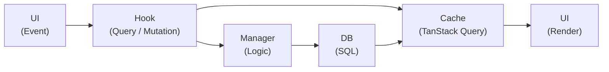
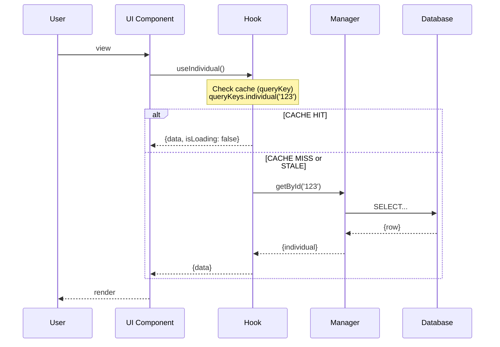
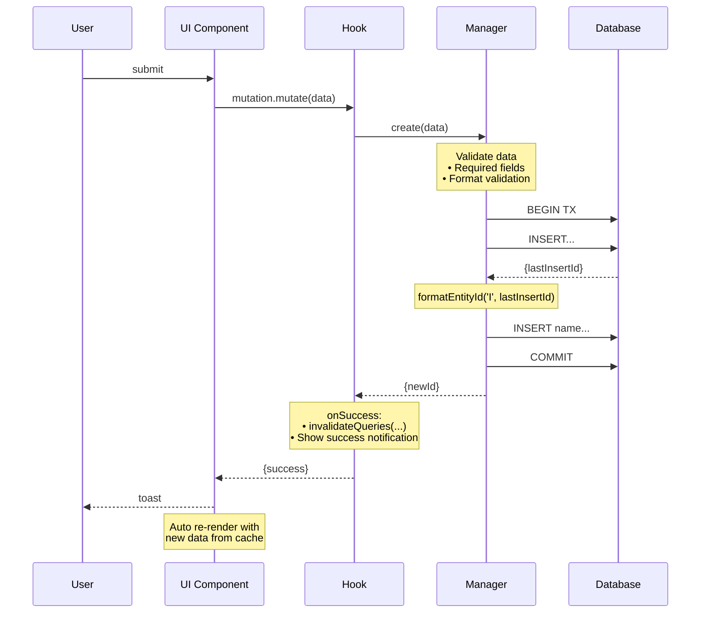

# Data Flow

## General Principle

The app follows a unidirectional flow with clear separation of responsibilities. Every read and write travels the same path:

- **UI** renders cache state and dispatches events; it never calls a Manager or the DB directly.
- **Hooks** wrap Managers in TanStack Query (`useQuery` / `useMutation`), own the cache, and expose loading/error state.
- **Managers** hold business logic — validation, multi-entity orchestration, transactions. No React dependency. Code in `src/managers/`.
- **DB layer** is the only code that runs SQL. Code in `src/db/`.

Hooks live in `src/hooks/`.

## Read Flow (Query)

A read checks the TanStack Query cache first; only a cache miss or stale entry reaches the Manager and DB.

## Write Flow (Mutation)

A write goes through Manager validation, runs inside a DB transaction, then invalidates the affected cache keys so dependent views re-render automatically.

## Cache Keys

All TanStack Query keys are centralized in the `queryKeys` object (`src/lib/query-keys.ts`) — **never hardcode a key** in a hook or an `invalidateQueries` call. Invalidation is targeted: a mutation invalidates the specific entity key plus any list/related keys it can affect (e.g. deleting a person also invalidates families).

## Global State

Client-only UI state (current tree, theme, locale, recent trees) lives in the Zustand store, persisted to localStorage. It is distinct from server state, which TanStack Query owns. Components should select narrow slices of the store to avoid needless re-renders.

## Error Handling

Errors are handled at the layer that can act on them:

- **Validation errors** are raised by the Manager and surfaced as inline form-field feedback.
- **Database errors** are surfaced as a toast notification.
- **Render errors** are caught by a React error boundary, which shows a fallback with a retry.

This keeps each failure mode visible where the user can respond to it.
