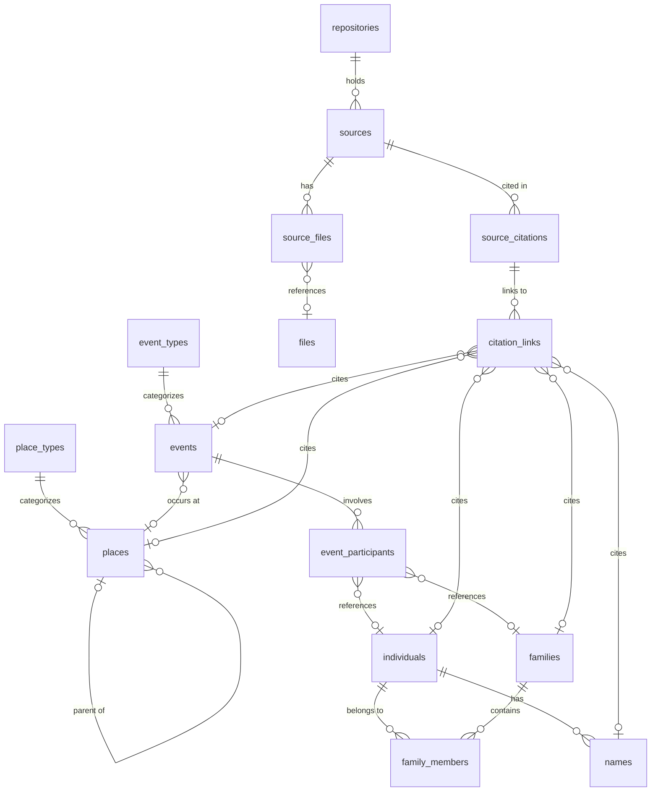

# Database Schema

This document describes the **layout and conventions** of the SQLite databases. It deliberately does **not** reproduce `CREATE TABLE` statements or TypeScript types — those have a single source of truth in the repo and would drift if copied here:

- Schema (DDL) — `src/db/connection.ts`
- Domain types — `src/types/database.ts`

See [Database Layer API](../api/database-layer.md) for the CRUD contract.

## Dual-Database Architecture

The app holds two kinds of SQLite database:

| Database  | File        | Purpose                               |
| --------- | ----------- | ------------------------------------- |
| System DB | `system.db` | App metadata: tree registry, settings |
| Tree DB   | `<tree>.db` | All genealogical data for one tree    |

Each tree is a **self-contained folder** the user chooses at creation time:

```
~/Documents/tremblay-bouchard/
├── tremblay-bouchard.db   # Tree database
└── media/                 # Media files (scans, images, PDFs)
```

The system DB stores the **absolute path** to each tree folder, so different trees can live in different locations (Documents, external drive, cloud-synced folder). The tree DB and its `media/` directory travel together — file records store paths _relative to the tree folder root_, keeping a tree portable if moved. `system.db` itself lives in the Tauri app-data directory.

## Connection PRAGMAs

PRAGMAs do not persist across connections; they are re-applied in code on every `Database.load()`. The exact values live in `src/db/connection.ts` — the rationale:

| PRAGMA         | Why                                                                                             |
| -------------- | ----------------------------------------------------------------------------------------------- |
| `journal_mode` | WAL — better concurrency and write performance than a rollback journal.                         |
| `synchronous`  | NORMAL — safe under WAL; good durability/performance balance.                                   |
| `foreign_keys` | **Critical** — SQLite disables FK enforcement by default; must be ON for referential integrity. |
| `busy_timeout` | Wait on a lock instead of failing immediately.                                                  |
| `cache_size`   | Larger page cache for read performance.                                                         |
| `temp_store`   | Keep temporary tables/indexes in memory.                                                        |

## Entity Relationships

The tree DB schema, expressed as a prose relationship map:

- An **individual** has many **names** (one flagged primary) and belongs to many **families** through **family_members** (role: husband / wife / child, with a pedigree type).
- A **family** contains many **family_members**.
- An **event** is categorized by an **event_type**, optionally **occurs at** a **place**, and **involves** individuals or families through **event_participants** (role: principal / witness / officiant / …).
- A **place** is categorized by a **place_type** and is **hierarchical** — a place may have a parent place.
- A **repository** holds many **sources**.
- A **source** is **cited** by many **source_citations** and is linked to media **files** through **source_files**.
- A **source_citation** is attached to entities through **citation_links** — a polymorphic link to an individual, name, event, family, or place.
- `tree_meta` is a key/value table holding schema version and authoring software metadata.



The system DB holds just two tables: `trees` (the registered-tree list, with a unique absolute `path`) and `app_settings` (key/value preferences).

## Conventions

### IDs

In the database, every table has an `INTEGER PRIMARY KEY AUTOINCREMENT`. In TypeScript, IDs are always `string` — but primary entities use a **prefixed display format** applied at the DB boundary, while the rest use a plain `String(raw.id)`.

**Prefixed format (primary entities only):** `{PREFIX}-{NNNN}`, zero-padded to 4 digits. Conversion lives in `src/lib/entityId.ts` (`formatEntityId`, `parseEntityId`).

| Entity     | Prefix | Example  |
| ---------- | ------ | -------- |
| Individual | `I`    | `I-0001` |
| Family     | `F`    | `F-0001` |
| Event      | `E`    | `E-0001` |
| Place      | `P`    | `P-0001` |
| Source     | `S`    | `S-0001` |
| Repository | `R`    | `R-0001` |

**Non-prefixed entities** use raw `String(raw.id)`: trees, names, family_members, place_types, event_types, event_participants, source_citations, citation_links. These are link/lookup rows that never appear standalone in a URL, so a human-readable ID buys nothing.

**Why prefixed IDs:** human-readable identifiers in the UI and URLs, with no schema change. If a count ever exceeds 9999, the padding is widened in the utility (e.g. `padStart(5, '0')`) — no DB migration.

### Internationalization

**The database stores identifiers, never translatable display text.**

System-defined enums and types (`event_types.tag`, `place_types.tag`, `names.type`, `family_members.role`, …) store code identifiers only; display names are resolved through i18n at the UI layer. Only user-created custom values (e.g. `event_types.custom_name`) are stored as text. This keeps the database language-agnostic — adding a locale never requires a schema change.

### Timestamps

`created_at` / `updated_at` are ISO 8601 text, always **UTC**. `created_at` is immutable; `updated_at` is rewritten on every modification.

### Soft delete

Not implemented for v1. Deletions are permanent and rely on `ON DELETE CASCADE`.

### GEDCOM interop (`event_types`)

`event_types.tag` doubles as the GEDCOM code for system types. On **export**, system types emit their `tag` directly (`1 BIRT`) while custom types emit `1 EVEN` + `2 TYPE {custom_name}`. On **import**, known tags map to system types, and `EVEN` + `TYPE` creates a custom type with `custom_name`. The same `tag`-vs-`custom_name` split applies to `place_types` (without GEDCOM codes).
