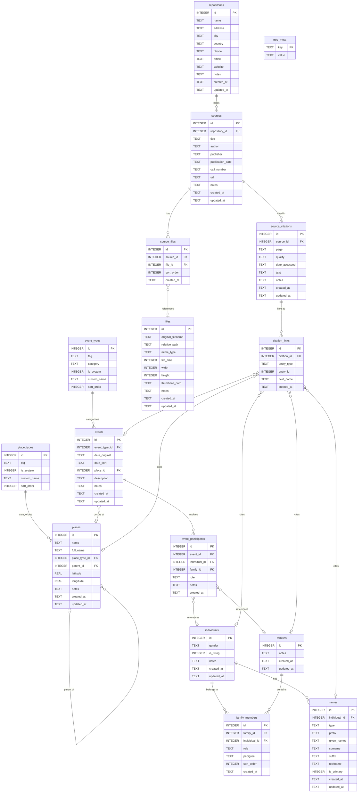

# Database Schema

## Dual-Database Architecture

The application uses two types of SQLite databases:

```
~/Library/Application Support/vata-app/
└── system.db                    # System database (unique)

# Trees are stored in user-chosen directories:
~/Documents/tremblay-bouchard/   # User picks location at tree creation
├── tremblay-bouchard.db         # Tree database
└── media/                       # Media files (images, scans, documents)
    ├── mariage-jean-marie-1895.jpg
    └── recensement-1901-p3.pdf
```

Each tree is a self-contained folder. The system database stores the absolute path to each tree folder. Different trees can be stored in different locations (e.g., Documents, external drive, cloud-synced folder).

## Connection PRAGMAs

Every database connection must execute these PRAGMAs immediately after opening (before any transaction). See [Tech Stack - SQLite](tech-stack.md#sqlite) for the connection code.

| PRAGMA | Value | Rationale |
|--------|-------|------------|
| `journal_mode` | `WAL` | Write-Ahead Logging; better concurrency and write performance than rollback journal |
| `synchronous` | `NORMAL` | Safe with WAL; good balance of durability and performance |
| `foreign_keys` | `ON` | **Critical**: SQLite disables foreign keys by default; must be enabled for referential integrity |
| `busy_timeout` | `5000` | Wait up to 5 seconds on lock instead of failing immediately |
| `cache_size` | `-20000` | 20 MB page cache (negative value = KB) for better read performance |
| `temp_store` | `MEMORY` | Temporary tables and indexes in memory |

PRAGMAs do not persist across connections; they must be set in code after each `Database.load()`.

## System Database (system.db)

Database for application metadata.

### Table: trees

List of trees registered in the application.

```sql
CREATE TABLE trees (
    id INTEGER PRIMARY KEY AUTOINCREMENT,
    name TEXT NOT NULL,
    path TEXT NOT NULL UNIQUE,
    description TEXT,
    individual_count INTEGER NOT NULL DEFAULT 0,
    family_count INTEGER NOT NULL DEFAULT 0,
    last_opened_at TEXT,
    created_at TEXT NOT NULL DEFAULT (datetime('now')),
    updated_at TEXT NOT NULL DEFAULT (datetime('now'))
);

CREATE INDEX idx_trees_last_opened ON trees(last_opened_at DESC);
```

The `path` column stores the absolute path to the tree folder (e.g., `/Users/jean/Documents/tremblay-bouchard`). The tree database file is `{path}/{tree-name}.db` and media files are stored in `{path}/media/`.

**TypeScript Interface**:

```typescript
interface Tree {
  id: string;
  name: string;
  path: string;
  description: string | null;
  individualCount: number;
  familyCount: number;
  lastOpenedAt: string | null;
  createdAt: string;
  updatedAt: string;
}

interface CreateTreeInput {
  name: string;
  path: string;
  description?: string;
}

interface UpdateTreeInput {
  name?: string;
  description?: string;
}
```

### Table: app_settings

Global application preferences.

```sql
CREATE TABLE app_settings (
    key TEXT PRIMARY KEY,
    value TEXT NOT NULL
);
```

---

## Tree Database ({tree-name}.db)

Each genealogical tree has its own database with the following schema.

### Table: individuals

People in the genealogical tree.

```sql
CREATE TABLE individuals (
    id INTEGER PRIMARY KEY AUTOINCREMENT,
    gender TEXT CHECK(gender IN ('M', 'F', 'U')) DEFAULT 'U',
    is_living INTEGER DEFAULT 1,
    notes TEXT,
    created_at TEXT NOT NULL DEFAULT (datetime('now')),
    updated_at TEXT NOT NULL DEFAULT (datetime('now'))
);

CREATE INDEX idx_individuals_gender ON individuals(gender);
CREATE INDEX idx_individuals_is_living ON individuals(is_living);
```

**TypeScript Interface**:

```typescript
type Gender = "M" | "F" | "U";

interface Individual {
  id: string;
  gender: Gender;
  isLiving: boolean;
  notes: string | null;
  createdAt: string;
  updatedAt: string;
}

interface CreateIndividualInput {
  gender?: Gender;
  isLiving?: boolean;
  notes?: string;
}

interface UpdateIndividualInput {
  gender?: Gender;
  isLiving?: boolean;
  notes?: string;
}

// Enriched view with names and main events
interface IndividualWithDetails extends Individual {
  primaryName: Name | null;
  names: Name[];
  birthEvent: Event | null;
  deathEvent: Event | null;
  citations: SourceCitationWithSource[];
}
```

### Table: names

Names of individuals (a person can have multiple names).

```sql
CREATE TABLE names (
    id INTEGER PRIMARY KEY AUTOINCREMENT,
    individual_id INTEGER NOT NULL,
    type TEXT NOT NULL DEFAULT 'birth',
    prefix TEXT,
    given_names TEXT,
    surname TEXT,
    suffix TEXT,
    nickname TEXT,
    is_primary INTEGER DEFAULT 0,
    created_at TEXT NOT NULL DEFAULT (datetime('now')),
    updated_at TEXT NOT NULL DEFAULT (datetime('now')),
    FOREIGN KEY (individual_id) REFERENCES individuals(id) ON DELETE CASCADE
);

CREATE INDEX idx_names_individual ON names(individual_id);
CREATE INDEX idx_names_surname ON names(surname);
CREATE INDEX idx_names_given ON names(given_names);
CREATE INDEX idx_names_primary ON names(individual_id, is_primary);
```

**TypeScript Interface**:

```typescript
type NameType =
  | "birth"
  | "married"
  | "adopted"
  | "aka"
  | "immigrant"
  | "religious"
  | "other";

interface Name {
  id: string;
  individualId: string;
  type: NameType;
  prefix: string | null; // "Dr.", "Rev."
  givenNames: string | null; // "Jean Pierre Marie"
  surname: string | null; // "Dupont"
  suffix: string | null; // "Jr.", "III"
  nickname: string | null; // "Pierrot"
  isPrimary: boolean;
  createdAt: string;
  updatedAt: string;
}

interface CreateNameInput {
  individualId: string;
  type?: NameType;
  prefix?: string;
  givenNames?: string;
  surname?: string;
  suffix?: string;
  nickname?: string;
  isPrimary?: boolean;
}

// Formatting for display
interface NameDisplay {
  full: string; // "Dr. Jean Pierre Marie Dupont Jr."
  short: string; // "Jean Pierre Dupont"
  sortable: string; // "Dupont, Jean Pierre Marie"
}

// Enriched view with citations
interface NameWithCitations extends Name {
  citations: SourceCitationWithSource[];
}
```

### Table: families

Unions/families (couples with or without children).

```sql
CREATE TABLE families (
    id INTEGER PRIMARY KEY AUTOINCREMENT,
    notes TEXT,
    created_at TEXT NOT NULL DEFAULT (datetime('now')),
    updated_at TEXT NOT NULL DEFAULT (datetime('now'))
);
```

**TypeScript Interface**:

```typescript
interface Family {
  id: string;
  notes: string | null;
  createdAt: string;
  updatedAt: string;
}

// Enriched view
interface FamilyWithMembers extends Family {
  husband: IndividualWithDetails | null;
  wife: IndividualWithDetails | null;
  children: IndividualWithDetails[];
  marriageEvent: Event | null;
  citations: SourceCitationWithSource[];
}
```

### Table: family_members

Links between individuals and families.

```sql
CREATE TABLE family_members (
    id INTEGER PRIMARY KEY AUTOINCREMENT,
    family_id INTEGER NOT NULL,
    individual_id INTEGER NOT NULL,
    role TEXT NOT NULL CHECK(role IN ('husband', 'wife', 'child')),
    pedigree TEXT CHECK(pedigree IN ('birth', 'adopted', 'foster', 'sealing', 'step')),
    sort_order INTEGER DEFAULT 0,
    created_at TEXT NOT NULL DEFAULT (datetime('now')),
    FOREIGN KEY (family_id) REFERENCES families(id) ON DELETE CASCADE,
    FOREIGN KEY (individual_id) REFERENCES individuals(id) ON DELETE CASCADE,
    UNIQUE(family_id, individual_id, role)
);

CREATE INDEX idx_family_members_family ON family_members(family_id);
CREATE INDEX idx_family_members_individual ON family_members(individual_id);
```

**TypeScript Interface**:

```typescript
type FamilyRole = "husband" | "wife" | "child";
type Pedigree = "birth" | "adopted" | "foster" | "sealing" | "step";

interface FamilyMember {
  id: string;
  familyId: string;
  individualId: string;
  role: FamilyRole;
  pedigree: Pedigree | null;
  sortOrder: number;
  createdAt: string;
}

interface CreateFamilyMemberInput {
  familyId: string;
  individualId: string;
  role: FamilyRole;
  pedigree?: Pedigree;
  sortOrder?: number;
}
```

### Table: place_types

Configurable place types (e.g. city, country, cemetery). Same pattern as event types: system types have an optional tag (for i18n), custom types have `custom_name`. The DB supports custom place types from the start.

```sql
CREATE TABLE place_types (
    id INTEGER PRIMARY KEY AUTOINCREMENT,
    tag TEXT UNIQUE,  -- Optional identifier for system types, NULL for custom types
    is_system INTEGER DEFAULT 0,
    custom_name TEXT,  -- Display name for user-defined place types only
    sort_order INTEGER DEFAULT 0,
    CHECK (
        (is_system = 1 AND tag IS NOT NULL AND custom_name IS NULL) OR
        (is_system = 0 AND custom_name IS NOT NULL)
    )
);

-- Optional: insert default system place types (e.g. city, country) later
```

**TypeScript Interface**:

```typescript
interface PlaceType {
  id: string;
  tag: string | null; // Optional (system types)
  isSystem: boolean;
  customName: string | null; // Display name (custom types only)
  sortOrder: number;
}

function getPlaceTypeDisplayName(placeType: PlaceType, t: TFunction): string {
  if (placeType.isSystem && placeType.tag) {
    return t(`placeType.${placeType.tag}`);
  }
  return placeType.customName ?? "";
}
```

### Table: places

Places with hierarchy. Optional `place_type_id` links to a type (city, country, etc.) that can be system or user-defined.

```sql
CREATE TABLE places (
    id INTEGER PRIMARY KEY AUTOINCREMENT,
    name TEXT NOT NULL,
    full_name TEXT NOT NULL,
    place_type_id INTEGER,
    parent_id INTEGER,
    latitude REAL,
    longitude REAL,
    notes TEXT,
    created_at TEXT NOT NULL DEFAULT (datetime('now')),
    updated_at TEXT NOT NULL DEFAULT (datetime('now')),
    FOREIGN KEY (place_type_id) REFERENCES place_types(id) ON DELETE SET NULL,
    FOREIGN KEY (parent_id) REFERENCES places(id) ON DELETE SET NULL
);

CREATE INDEX idx_places_name ON places(name);
CREATE INDEX idx_places_full_name ON places(full_name);
CREATE INDEX idx_places_place_type ON places(place_type_id);
CREATE INDEX idx_places_parent ON places(parent_id);
```

**TypeScript Interface**:

```typescript
interface Place {
  id: string;
  name: string; // "Montreal"
  fullName: string; // "Montreal, Quebec, Canada"
  placeTypeId: string | null;
  parentId: string | null;
  latitude: number | null;
  longitude: number | null;
  notes: string | null;
  createdAt: string;
  updatedAt: string;
}

interface PlaceWithHierarchy extends Place {
  placeType: PlaceType | null;
  parent: Place | null;
  children: Place[];
  path: Place[]; // [Canada, Quebec, Montreal]
}

interface CreatePlaceInput {
  name: string;
  fullName?: string;
  placeTypeId?: string;
  parentId?: string;
  latitude?: number;
  longitude?: number;
  notes?: string;
}
```

### Table: event_types

Configurable event types.

```sql
CREATE TABLE event_types (
    id INTEGER PRIMARY KEY AUTOINCREMENT,
    tag TEXT UNIQUE,  -- GEDCOM code for system types, NULL for custom types
    category TEXT NOT NULL CHECK(category IN ('individual', 'family')),
    is_system INTEGER DEFAULT 0,
    custom_name TEXT,  -- Display name for user-defined event types only
    sort_order INTEGER DEFAULT 0,
    CHECK (
        (is_system = 1 AND tag IS NOT NULL AND custom_name IS NULL) OR
        (is_system = 0 AND custom_name IS NOT NULL)
    )
);

-- System events (display names resolved via i18n using tag)
INSERT INTO event_types (tag, category, is_system, sort_order) VALUES
    ('BIRT', 'individual', 1, 1),
    ('CHR', 'individual', 1, 2),
    ('DEAT', 'individual', 1, 3),
    ('BURI', 'individual', 1, 4),
    ('OCCU', 'individual', 1, 10),
    ('RESI', 'individual', 1, 11),
    ('EDUC', 'individual', 1, 12),
    ('RELI', 'individual', 1, 13),
    ('IMMI', 'individual', 1, 14),
    ('EMIG', 'individual', 1, 15),
    ('NATU', 'individual', 1, 16),
    ('MARR', 'family', 1, 1),
    ('MARB', 'family', 1, 2),
    ('MARC', 'family', 1, 3),
    ('DIV', 'family', 1, 4),
    ('DIVF', 'family', 1, 5),
    ('ANUL', 'family', 1, 6);
```

**TypeScript Interface**:

```typescript
type EventCategory = "individual" | "family";

interface EventType {
  id: string;
  tag: string | null; // GEDCOM code (system types only)
  category: EventCategory;
  isSystem: boolean;
  customName: string | null; // Display name (custom types only)
  sortOrder: number;
}

// Helper function to get display name
function getEventTypeDisplayName(eventType: EventType, t: TFunction): string {
  if (eventType.isSystem && eventType.tag) {
    return t(`eventType.${eventType.tag}`);
  }
  return eventType.customName ?? "";
}
```

**GEDCOM Interop**:

- **Export**: System types use the `tag` directly (`1 BIRT`). Custom types export as `1 EVEN` + `2 TYPE {custom_name}`.
- **Import**: Known tags map to system types. `EVEN` + `TYPE` creates a custom type with `custom_name`.

### Table: events

Life events (birth, marriage, death, etc.).

```sql
CREATE TABLE events (
    id INTEGER PRIMARY KEY AUTOINCREMENT,
    event_type_id INTEGER NOT NULL,
    date_original TEXT,
    date_sort TEXT,
    place_id INTEGER,
    description TEXT,
    notes TEXT,
    created_at TEXT NOT NULL DEFAULT (datetime('now')),
    updated_at TEXT NOT NULL DEFAULT (datetime('now')),
    FOREIGN KEY (event_type_id) REFERENCES event_types(id),
    FOREIGN KEY (place_id) REFERENCES places(id) ON DELETE SET NULL
);

CREATE INDEX idx_events_type ON events(event_type_id);
CREATE INDEX idx_events_date_sort ON events(date_sort);
CREATE INDEX idx_events_place ON events(place_id);
```

**TypeScript Interface**:

```typescript
interface Event {
  id: string;
  eventTypeId: string;
  dateOriginal: string | null; // "ABT 1850" - Original text
  dateSort: string | null; // "1850-01-01" - For sorting
  placeId: string | null;
  description: string | null;
  notes: string | null;
  createdAt: string;
  updatedAt: string;
}

interface EventWithDetails extends Event {
  eventType: EventType;
  place: Place | null;
  participants: EventParticipant[];
  citations: SourceCitationWithSource[];
}

interface CreateEventInput {
  eventTypeId: string;
  dateOriginal?: string;
  dateSort?: string;
  placeId?: string;
  description?: string;
  notes?: string;
}
```

### Table: event_participants

Links between events and individuals/families.

```sql
CREATE TABLE event_participants (
    id INTEGER PRIMARY KEY AUTOINCREMENT,
    event_id INTEGER NOT NULL,
    individual_id INTEGER,
    family_id INTEGER,
    role TEXT NOT NULL DEFAULT 'principal',
    notes TEXT,
    created_at TEXT NOT NULL DEFAULT (datetime('now')),
    FOREIGN KEY (event_id) REFERENCES events(id) ON DELETE CASCADE,
    FOREIGN KEY (individual_id) REFERENCES individuals(id) ON DELETE CASCADE,
    FOREIGN KEY (family_id) REFERENCES families(id) ON DELETE CASCADE,
    CHECK ((individual_id IS NOT NULL AND family_id IS NULL) OR
           (individual_id IS NULL AND family_id IS NOT NULL))
);

CREATE INDEX idx_event_participants_event ON event_participants(event_id);
CREATE INDEX idx_event_participants_individual ON event_participants(individual_id);
CREATE INDEX idx_event_participants_family ON event_participants(family_id);
```

**TypeScript Interface**:

```typescript
type ParticipantRole =
  | "principal"
  | "witness"
  | "officiant"
  | "godparent"
  | "informant"
  | "other";

interface EventParticipant {
  id: string;
  eventId: string;
  individualId: string | null;
  familyId: string | null;
  role: ParticipantRole;
  notes: string | null;
  createdAt: string;
}

interface CreateEventParticipantInput {
  eventId: string;
  individualId?: string;
  familyId?: string;
  role?: ParticipantRole;
  notes?: string;
}
```

### Table: repositories

Archive repositories (libraries, departmental archives, etc.).

```sql
CREATE TABLE repositories (
    id INTEGER PRIMARY KEY AUTOINCREMENT,
    name TEXT NOT NULL,
    address TEXT,
    city TEXT,
    country TEXT,
    phone TEXT,
    email TEXT,
    website TEXT,
    notes TEXT,
    created_at TEXT NOT NULL DEFAULT (datetime('now')),
    updated_at TEXT NOT NULL DEFAULT (datetime('now'))
);

CREATE INDEX idx_repositories_name ON repositories(name);
```

**TypeScript Interface**:

```typescript
interface Repository {
  id: string;
  name: string;
  address: string | null;
  city: string | null;
  country: string | null;
  phone: string | null;
  email: string | null;
  website: string | null;
  notes: string | null;
  createdAt: string;
  updatedAt: string;
}

interface RepositoryWithDetails extends Repository {
  sources: Source[];
  sourceCount: number;
}

interface CreateRepositoryInput {
  name: string;
  address?: string;
  city?: string;
  country?: string;
  phone?: string;
  email?: string;
  website?: string;
  notes?: string;
}

interface UpdateRepositoryInput {
  name?: string;
  address?: string;
  city?: string;
  country?: string;
  phone?: string;
  email?: string;
  website?: string;
  notes?: string;
}
```

### Table: sources

Documentary sources.

```sql
CREATE TABLE sources (
    id INTEGER PRIMARY KEY AUTOINCREMENT,
    repository_id INTEGER,
    title TEXT NOT NULL,
    author TEXT,
    publisher TEXT,
    publication_date TEXT,
    call_number TEXT,
    url TEXT,
    notes TEXT,
    created_at TEXT NOT NULL DEFAULT (datetime('now')),
    updated_at TEXT NOT NULL DEFAULT (datetime('now')),
    FOREIGN KEY (repository_id) REFERENCES repositories(id) ON DELETE SET NULL
);

CREATE INDEX idx_sources_title ON sources(title);
CREATE INDEX idx_sources_repository ON sources(repository_id);
```

**TypeScript Interface**:

```typescript
interface Source {
  id: string;
  repositoryId: string | null;
  title: string;
  author: string | null;
  publisher: string | null;
  publicationDate: string | null;
  callNumber: string | null;
  url: string | null;
  notes: string | null;
  createdAt: string;
  updatedAt: string;
}

interface SourceWithDetails extends Source {
  repository: Repository | null;
  files: TreeFile[];
  citationCount: number;
}

interface CreateSourceInput {
  repositoryId?: string;
  title: string;
  author?: string;
  publisher?: string;
  publicationDate?: string;
  callNumber?: string;
  url?: string;
  notes?: string;
}

interface UpdateSourceInput {
  repositoryId?: string;
  title?: string;
  author?: string;
  publisher?: string;
  publicationDate?: string;
  callNumber?: string;
  url?: string;
  notes?: string;
}
```

### Table: source_citations

Source citations linked to entities.

```sql
CREATE TABLE source_citations (
    id INTEGER PRIMARY KEY AUTOINCREMENT,
    source_id INTEGER NOT NULL,
    page TEXT,
    quality TEXT CHECK(quality IN ('primary', 'secondary', 'questionable', 'unreliable')),
    date_accessed TEXT,
    text TEXT,
    notes TEXT,
    created_at TEXT NOT NULL DEFAULT (datetime('now')),
    updated_at TEXT NOT NULL DEFAULT (datetime('now')),
    FOREIGN KEY (source_id) REFERENCES sources(id) ON DELETE CASCADE
);

CREATE INDEX idx_citations_source ON source_citations(source_id);
```

**TypeScript Interface**:

```typescript
type CitationQuality = "primary" | "secondary" | "questionable" | "unreliable";

interface SourceCitation {
  id: string;
  sourceId: string;
  page: string | null; // "p. 45" or "Folio 23, recto"
  quality: CitationQuality | null;
  dateAccessed: string | null;
  text: string | null; // Transcription or excerpt
  notes: string | null;
  createdAt: string;
  updatedAt: string;
}

interface SourceCitationWithSource extends SourceCitation {
  source: Source;
}

interface CreateCitationInput {
  sourceId: string;
  page?: string;
  quality?: CitationQuality;
  dateAccessed?: string;
  text?: string;
  notes?: string;
}

interface UpdateCitationInput {
  sourceId?: string;
  page?: string;
  quality?: CitationQuality;
  dateAccessed?: string;
  text?: string;
  notes?: string;
}
```

### Table: citation_links

Polymorphic links between citations and entities.

```sql
CREATE TABLE citation_links (
    id INTEGER PRIMARY KEY AUTOINCREMENT,
    citation_id INTEGER NOT NULL,
    entity_type TEXT NOT NULL CHECK(entity_type IN ('individual', 'name', 'event', 'family', 'place')),
    entity_id INTEGER NOT NULL,
    field_name TEXT,
    created_at TEXT NOT NULL DEFAULT (datetime('now')),
    FOREIGN KEY (citation_id) REFERENCES source_citations(id) ON DELETE CASCADE
);

CREATE INDEX idx_citation_links_citation ON citation_links(citation_id);
CREATE INDEX idx_citation_links_entity ON citation_links(entity_type, entity_id);
```

**TypeScript Interface**:

```typescript
type CitableEntityType = "individual" | "name" | "event" | "family" | "place";

interface CitationLink {
  id: string;
  citationId: string;
  entityType: CitableEntityType;
  entityId: string;
  fieldName: string | null; // E.g., "surname", "date" to cite a specific field
  createdAt: string;
}

interface CreateCitationLinkInput {
  citationId: string;
  entityType: CitableEntityType;
  entityId: string;
  fieldName?: string;
}
```

### Table: files

Media files (images, scanned documents, PDFs) attached to sources. Files are stored on disk in the tree's `media/` directory; this table stores metadata and the relative path.

```sql
CREATE TABLE files (
    id INTEGER PRIMARY KEY AUTOINCREMENT,
    original_filename TEXT NOT NULL,
    relative_path TEXT NOT NULL UNIQUE,
    mime_type TEXT NOT NULL,
    file_size INTEGER NOT NULL,
    width INTEGER,
    height INTEGER,
    thumbnail_path TEXT,
    notes TEXT,
    created_at TEXT NOT NULL DEFAULT (datetime('now')),
    updated_at TEXT NOT NULL DEFAULT (datetime('now'))
);

CREATE INDEX idx_files_mime_type ON files(mime_type);
```

The `relative_path` is relative to the tree folder root (e.g., `media/mariage-jean-marie-1895.jpg`). This ensures portability if the tree folder is moved.

**TypeScript Interface**:

```typescript
interface TreeFile {
  id: string;
  originalFilename: string;
  relativePath: string;
  mimeType: string;
  fileSize: number;
  width: number | null;
  height: number | null;
  thumbnailPath: string | null;
  notes: string | null;
  createdAt: string;
  updatedAt: string;
}

interface CreateFileInput {
  originalFilename: string;
  relativePath: string;
  mimeType: string;
  fileSize: number;
  width?: number;
  height?: number;
  thumbnailPath?: string;
  notes?: string;
}

interface UpdateFileInput {
  notes?: string;
  thumbnailPath?: string;
}
```

### Table: source_files

Junction table linking sources to their media files. A source can have multiple files (e.g., a multi-page document scan), and a file can be referenced by multiple sources.

```sql
CREATE TABLE source_files (
    id INTEGER PRIMARY KEY AUTOINCREMENT,
    source_id INTEGER NOT NULL,
    file_id INTEGER NOT NULL,
    sort_order INTEGER DEFAULT 0,
    created_at TEXT NOT NULL DEFAULT (datetime('now')),
    FOREIGN KEY (source_id) REFERENCES sources(id) ON DELETE CASCADE,
    FOREIGN KEY (file_id) REFERENCES files(id) ON DELETE CASCADE,
    UNIQUE(source_id, file_id)
);

CREATE INDEX idx_source_files_source ON source_files(source_id);
CREATE INDEX idx_source_files_file ON source_files(file_id);
```

**TypeScript Interface**:

```typescript
interface SourceFile {
  id: string;
  sourceId: string;
  fileId: string;
  sortOrder: number;
  createdAt: string;
}

interface CreateSourceFileInput {
  sourceId: string;
  fileId: string;
  sortOrder?: number;
}
```

### Table: tree_meta

Tree metadata.

```sql
CREATE TABLE tree_meta (
    key TEXT PRIMARY KEY,
    value TEXT NOT NULL
);

-- Initial values
INSERT INTO tree_meta (key, value) VALUES
    ('schema_version', '1'),
    ('created_at', datetime('now')),
    ('software', 'Vata App'),
    ('software_version', '1.0.0');
```

---

## Complete Relationship Diagram



## Conventions

### IDs

- **In database**: `INTEGER PRIMARY KEY AUTOINCREMENT` for all tables
- **In TypeScript**: `string` — primary entities use a **prefixed display format** at the DB boundary; others use `String(raw.id)`

**Prefixed format (primary entities only):** `{PREFIX}-{NNNN}` (e.g. `I-0001`, `F-0001`). Zero-padded to 4 digits. Implemented in `src/lib/entityId.ts`:

- `formatEntityId(prefix, dbId: number): string` — convert DB integer to display ID
- `parseEntityId(formattedId: string): number` — convert display ID back to integer for SQL

**Prefix mapping:**

| Entity     | Prefix | Example  |
| ---------- | ------ | -------- |
| Individual | I      | I-0001   |
| Family     | F      | F-0001   |
| Event      | E      | E-0001   |
| Place      | P      | P-0001   |
| Source     | S      | S-0001   |
| Repository | R      | R-0001   |

**Non-prefixed entities** (raw `String(raw.id)`): trees, names, family_members, place_types, event_types, event_participants, source_citations, citation_links.

**Reason:** Human-readable IDs in the UI and URLs; no schema change; if count exceeds 9999, increase padding in the utility (e.g. `padStart(5, '0')`) without DB migration.

### Timestamps

- Format: ISO 8601 (`TEXT` in SQLite)
- Always in UTC
- `created_at`: Immutable after creation
- `updated_at`: Updated on every modification

### Soft Delete

Not implemented for v1. Deletions are permanent with CASCADE.

### Transactions

All multi-table operations must be within a transaction:

```typescript
await db.execute("BEGIN TRANSACTION");
try {
  // ... operations
  await db.execute("COMMIT");
} catch (error) {
  await db.execute("ROLLBACK");
  throw error;
}
```

### Internationalization (i18n)

**Database stores identifiers, never translatable display text.**

- System-defined enums and types (e.g., `event_types.tag`, `place_types.tag`, `names.type`, `family_members.role`) store code identifiers only
- Display names are resolved through the i18n system at the UI layer using translation keys
- Only user-created custom values (e.g., custom event type names in `event_types.custom_name`, custom place type names in `place_types.custom_name`) are stored as text in the database
- This ensures the database remains language-agnostic and supports multiple locales without schema changes
