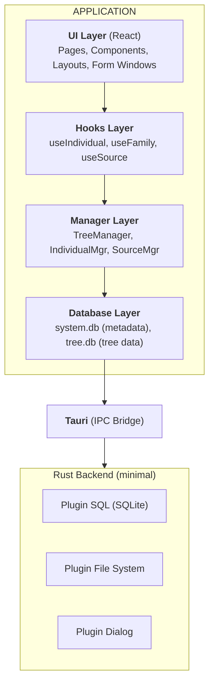
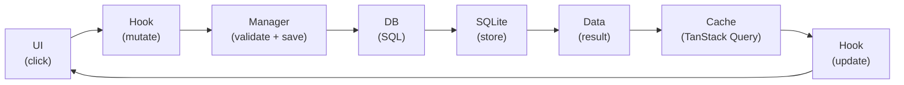
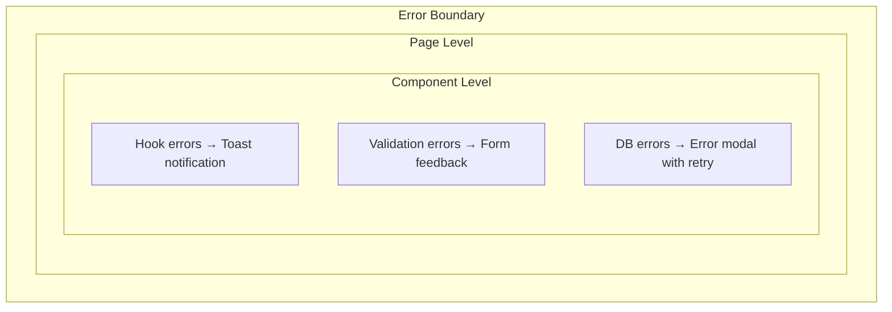

# Global Architecture

## Overview

Vata is a desktop application built with Tauri 2.0, combining a web frontend (React/TypeScript) and a native backend (Rust). The architecture follows a layered pattern for clear separation of responsibilities.

Development is structured by MVP (see [Roadmap](../roadmap.md)): MVP1 Foundation, MVP2 GEDCOM, MVP3 Primary Entities, MVP4 UI, MVP5 Sources, MVP6 Files. Mantine and the complete design system are introduced in MVP4; MVP1–3 use a minimalist HTML UI.



## Layer Descriptions

### 1. UI Layer (Presentation)

**Responsibility**: Display and user interactions

- **Pages**: Full application screens (Home, TreeView, IndividualView, etc.)
- **Components**: Reusable components (PersonCard, EventList, SourceBadge, etc.)
- **Layouts**: Layout structures (MainLayout, etc.)
- **Form windows**: Standalone native windows for create/edit flows (e.g. Create Person, Edit Person, Import GEDCOM). They load routes under `/standalone/` and render without MainLayout. Small in-window dialogs are used for unsaved-change and delete confirmations.

**Technologies**: React 18, TanStack Router. Mantine and react-i18next are added in MVP4.

### 2. Hooks Layer (Data Access)

**Responsibility**: Interface between UI and business logic

- Encapsulates calls to Managers
- Manages cache with TanStack Query
- Provides mutations with automatic invalidation
- Handles loading and error states

**Convention**: Always use the central `queryKeys` object for TanStack Query keys (never hardcode keys in hooks or invalidations).

**Example**:

```typescript
// queryKeys.ts
export const queryKeys = {
  individual: (id: string) => ["individual", id] as const,
  individuals: ["individuals"] as const,
};

// useIndividual.ts
export function useIndividual(id: string) {
  return useQuery({
    queryKey: queryKeys.individual(id),
    queryFn: () => IndividualManager.getById(id),
  });
}

export function useCreateIndividual() {
  const queryClient = useQueryClient();
  return useMutation({
    mutationFn: IndividualManager.create,
    onSuccess: () => {
      queryClient.invalidateQueries({ queryKey: queryKeys.individuals });
    },
  });
}
```

### 3. Manager Layer (Business Logic)

**Responsibility**: Orchestration and business rules

- Data validation before persistence
- Coordination between entities (e.g., creating a person with their names)
- Transaction management
- GEDCOM logic (import/export) - uses in-app module `@vata-apps/gedcom-parser` for parsing/serialization
- Date handling - uses in-app module `@vata-apps/gedcom-date` for parsing/formatting

**Characteristics**:

- Static classes or singletons
- No React dependency
- Unit testable
- Uses in-app modules for domain-specific logic (GEDCOM, dates); see [ADR-004](../decisions/adr-004-gedcom-libraries.md)

### 4. Database Layer (Persistence)

**Responsibility**: CRUD operations on SQLite

- SQL query execution
- Type conversion (string IDs ↔ integer IDs)
- Transaction management
- Schema initialization and migration

**Dual-database architecture**:

- `system.db`: List of trees, global preferences
- `{tree-name}.db`: One file per genealogical tree

## Typical Data Flow



### Example: Creating a Person

1. **UI**: The user fills out the form and clicks "Create"
2. **Hook**: `useCreateIndividual().mutate(data)` is called
3. **Manager**: `IndividualManager.create(data)`
   - Validates the data
   - Opens a transaction
   - Inserts the individual into `individuals`
   - Inserts the name into `names`
   - Commits the transaction
4. **DB**: Executes the SQL queries
5. **Hook**: Invalidates the cache via `queryKeys.individuals`
6. **UI**: The list refreshes automatically

## State Management

### Server State (TanStack Query)

- Data from the database
- Automatic cache with invalidation
- Intelligent refetch

### Client State (Zustand)

- Currently open tree
- UI preferences (theme, locale, etc.)
- Navigation state

### Internationalization (i18n)

- All UI strings go through `react-i18next` translation system
- Database stores identifiers only (e.g., `event_types.tag = 'BIRT'`), display names resolved via i18n (`t('eventType.BIRT')` → "Birth")
- Translation files organized by namespace (common, home, individual, family, event, source, place, settings)
- Locale preference stored in Zustand store and persisted
- Currently English-only, but infrastructure ready for additional languages

```typescript
// store.ts
interface AppState {
  currentTreeId: string | null;
  theme: "light" | "dark" | "system";
  locale: string; // e.g., 'en', 'fr' - defaults to system locale
  setCurrentTree: (id: string | null) => void;
  setLocale: (locale: string) => void;
}
```

## Error Handling



## Security

### Data Isolation

- Each tree in a separate SQLite file
- No network communication (local only)
- Tauri sandbox for file access

### Tauri Permissions

```json
{
  "permissions": ["sql:default", "fs:default", "dialog:default"]
}
```

## Performance

### Optimization Strategies

1. **Lazy loading**: Data loaded on demand
2. **Virtualization**: Virtualized lists for large trees
3. **Indexing**: SQLite indexes on frequently searched columns
4. **Pagination**: Batch loading for large lists
5. **Debouncing**: Delay on search and filters

### Target Metrics

- Startup time: < 2s
- Tree opening: < 500ms
- Search: < 200ms
- CRUD operations: < 100ms
