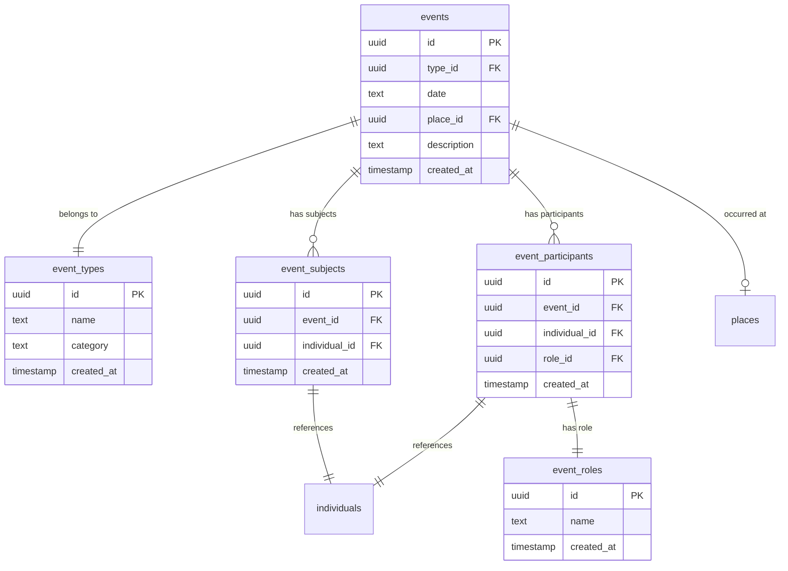

# Event System Refactor: Technical Analysis

**Document Version:** 1.0  
**Date:** May 2025  
**Author:** AI Assistant  
**Status:** Proposal - Awaiting Approval

## Executive Summary

This document outlines a comprehensive refactor of the current event system to support witnesses, multiple participants, and flexible role assignments in genealogical events. The current system separates individual and family events, limiting our ability to properly model real-world scenarios where events involve multiple people with different roles.

## Current System Analysis

### 1. Current Database Structure

**Existing Tables:**

- `individual_events` - Events linked to one individual
- `family_events` - Events linked to a family (husband + wife)
- `individual_event_types` - Types for individual events
- `family_event_types` - Types for family events

**Current Files:**

- `supabase/migrations/20250228001050_initial-tables.sql` - Contains all table definitions
- `supabase/migrations/20250228002000_initial-views.sql` - Contains views
- `src/types/event.ts` - Current event type definitions
- `src/api/fetchEvents.ts` - Current API for fetching events
- `src/components/event/EventHeader.tsx` - Event header component
- `src/components/event/PeopleInvolvedCard.tsx` - Shows people in events
- `src/pages/events/index.tsx` - Events list page
- `src/pages/events/$eventId.tsx` - Event detail page
- `src/utils/events.ts` - Event utility functions

### 2. Rigid Event Structure

- **Individual Events**: Limited to one person per event
- **Family Events**: Limited to husband and wife only
- **No Witness Support**: Cannot record witnesses for any event type
- **No Role Flexibility**: Cannot specify roles like godfather, officiant, etc.

### 2. Real-World Scenarios Not Supported

| Event Type | Current Support     | Missing Participants              |
| ---------- | ------------------- | --------------------------------- |
| Birth      | Baby only           | Parents, doctor, witnesses        |
| Marriage   | Husband + Wife only | Witnesses, officiant, parents     |
| Baptism    | Individual only     | Godparents, parents, officiant    |
| Death      | Individual only     | Witnesses, doctor, family present |

### 3. Technical Debt

- Duplicate event type systems (`individual_event_types` + `family_event_types`)
- Complex UI logic to handle two different event structures
- Inconsistent API patterns for fetching events
- Limited search capabilities across event types

## Proposed Solution

### 1. Unified Event System Architecture



### 2. Key Design Principles

#### **Event Subjects vs Participants**

- **Event Subjects**: People the event is primarily "about" (baby in birth, couple in marriage)
- **Event Participants**: Everyone involved, including subjects with their specific roles

#### **Dual Table Approach**

- `event_subjects`: Quick identification of primary people
- `event_participants`: Complete participation records with roles
- Subjects appear in both tables (with roles in participants)

#### **Flexible Role System**

- User-extensible role definitions
- No hardcoded role hierarchies
- Clear distinction through subject/participant separation

### 3. Key Design Decisions

#### **Why Dual Tables (event_subjects + event_participants)?**

We considered several approaches:

1. **Single table with is_primary flag** - Rejected because:

   - User confusion when adding custom roles
   - Inconsistent data entry
   - Complex UI logic

2. **Single table with role hierarchy** - Rejected because:

   - Role importance is contextual (witness more important in marriage than baptism)
   - Rigid system doesn't accommodate future needs

3. **Dual table approach** - **CHOSEN** because:
   - Clear separation of "who event is about" vs "who participated"
   - Simple queries for both use cases
   - User-friendly: easy to understand subjects vs participants
   - Future-proof: works with any custom roles

#### **Why RPC Functions Instead of Complex Joins?**

- **Supabase API Limitation**: Complex GROUP BY and STRING_AGG don't work well with Supabase's query builder
- **Performance**: Pre-optimized queries in database
- **Maintainability**: Complex logic in one place
- **Type Safety**: Consistent return types

#### **Why Remove Individual/Family Event Distinction?**

- **Real World**: Events don't fit neatly into individual vs family categories
- **Flexibility**: Any event can have any number of participants
- **Simplicity**: Single UI flow for all events
- **Extensibility**: Easy to add new event types without categorization

## Data Model Examples

### Birth Event

```sql
-- Event record
events: { id: "birth-123", type: "birth", date: "2023-08-20" }

-- Subjects (who the event is about)
event_subjects: [
  { event_id: "birth-123", individual_id: "baby-mary" }
]

-- Participants (everyone involved with roles)
event_participants: [
  { event_id: "birth-123", individual_id: "baby-mary", role: "subject" },
  { event_id: "birth-123", individual_id: "jane-doe", role: "mother" },
  { event_id: "birth-123", individual_id: "john-doe", role: "father" },
  { event_id: "birth-123", individual_id: "dr-smith", role: "doctor" }
]
```

### Marriage Event

```sql
-- Event record
events: { id: "marriage-456", type: "marriage", date: "2023-06-15" }

-- Subjects (who the event is about)
event_subjects: [
  { event_id: "marriage-456", individual_id: "john-doe" },
  { event_id: "marriage-456", individual_id: "jane-smith" }
]

-- Participants (everyone involved with roles)
event_participants: [
  { event_id: "marriage-456", individual_id: "john-doe", role: "husband" },
  { event_id: "marriage-456", individual_id: "jane-smith", role: "wife" },
  { event_id: "marriage-456", individual_id: "mike-johnson", role: "witness" },
  { event_id: "marriage-456", individual_id: "father-brown", role: "officiant" }
]
```

## Implementation Strategy

### Phase 1: Database Schema (1 day)

#### 1.1 Update Tables Migration

**File:** `supabase/migrations/20250228001050_initial-tables.sql`

**Remove these tables:**

```sql
DROP TABLE individual_events;
DROP TABLE family_events;
DROP TABLE individual_event_types;
DROP TABLE family_event_types;
```

**Add these new tables:**

```sql
-- Event types (unified)
CREATE TABLE event_types (
    id uuid PRIMARY KEY DEFAULT gen_random_uuid(),
    created_at timestamp with time zone DEFAULT now(),
    name text NOT NULL UNIQUE,
    category text NOT NULL -- 'vital', 'religious', 'civil', etc.
);

-- Main events table
CREATE TABLE events (
    id uuid PRIMARY KEY DEFAULT gen_random_uuid(),
    created_at timestamp with time zone DEFAULT now(),
    type_id uuid NOT NULL REFERENCES event_types(id),
    date text,
    place_id uuid REFERENCES places(id),
    description text
);

-- Event roles
CREATE TABLE event_roles (
    id uuid PRIMARY KEY DEFAULT gen_random_uuid(),
    created_at timestamp with time zone DEFAULT now(),
    name text NOT NULL UNIQUE
);

-- Event subjects (who the event is about)
CREATE TABLE event_subjects (
    id uuid PRIMARY KEY DEFAULT gen_random_uuid(),
    created_at timestamp with time zone DEFAULT now(),
    event_id uuid NOT NULL REFERENCES events(id) ON DELETE CASCADE,
    individual_id uuid NOT NULL REFERENCES individuals(id) ON DELETE CASCADE
);

-- Event participants (everyone involved with roles)
CREATE TABLE event_participants (
    id uuid PRIMARY KEY DEFAULT gen_random_uuid(),
    created_at timestamp with time zone DEFAULT now(),
    event_id uuid NOT NULL REFERENCES events(id) ON DELETE CASCADE,
    individual_id uuid NOT NULL REFERENCES individuals(id) ON DELETE CASCADE,
    role_id uuid NOT NULL REFERENCES event_roles(id)
);
```

**Initial seed data:**

```sql
-- Event types
INSERT INTO event_types (name, category) VALUES
('birth', 'vital'),
('death', 'vital'),
('marriage', 'vital'),
('baptism', 'religious'),
('burial', 'religious'),
('graduation', 'civil'),
('immigration', 'civil');

-- Event roles
INSERT INTO event_roles (name) VALUES
('subject'),
('husband'),
('wife'),
('deceased'),
('mother'),
('father'),
('witness'),
('godfather'),
('godmother'),
('officiant'),
('doctor');
```

#### 1.2 Update Views Migration

**File:** `supabase/migrations/20250228002000_initial-views.sql`

**Add event details view:**

```sql
CREATE VIEW event_details AS
SELECT
  e.*,
  et.name as event_type_name,
  et.category as event_category,
  p.name as place_name,
  -- Subjects as JSON array
  (
    SELECT json_agg(
      json_build_object(
        'id', i.id,
        'name', CONCAT(n.first_name, ' ', n.last_name)
      )
    )
    FROM event_subjects es
    JOIN individuals i ON es.individual_id = i.id
    JOIN names n ON i.id = n.individual_id AND n.is_primary = true
    WHERE es.event_id = e.id
  ) as subjects
FROM events e
JOIN event_types et ON e.type_id = et.id
LEFT JOIN places p ON e.place_id = p.id;
```

#### 1.3 Create RPC Functions Migration

**File:** `supabase/migrations/20250228003000_event-rpc-functions.sql` (NEW)

```sql
-- Function for events list with search and pagination
CREATE OR REPLACE FUNCTION get_events_with_subjects(
  search_text TEXT DEFAULT NULL,
  page_number INTEGER DEFAULT 1,
  sort_field TEXT DEFAULT 'date',
  sort_direction TEXT DEFAULT 'desc'
)
RETURNS TABLE (
  id UUID,
  date TEXT,
  description TEXT,
  event_type_name TEXT,
  place_name TEXT,
  subjects TEXT
) AS $$
BEGIN
  RETURN QUERY
  SELECT
    e.id,
    e.date,
    e.description,
    et.name as event_type_name,
    p.name as place_name,
    STRING_AGG(DISTINCT CONCAT(n.first_name, ' ', n.last_name), ', ') as subjects
  FROM events e
  JOIN event_types et ON e.type_id = et.id
  LEFT JOIN places p ON e.place_id = p.id
  JOIN event_subjects es ON e.id = es.event_id
  JOIN individuals i ON es.individual_id = i.id
  JOIN names n ON i.id = n.individual_id AND n.is_primary = true
  WHERE (search_text IS NULL OR
         CONCAT(n.first_name, ' ', n.last_name) ILIKE '%' || search_text || '%' OR
         e.description ILIKE '%' || search_text || '%')
  GROUP BY e.id, e.date, e.description, et.name, p.name
  ORDER BY
    CASE WHEN sort_field = 'date' AND sort_direction = 'desc' THEN e.date END DESC,
    CASE WHEN sort_field = 'date' AND sort_direction = 'asc' THEN e.date END ASC;
END;
$$ LANGUAGE plpgsql;

-- Function for event details with all participants
CREATE OR REPLACE FUNCTION get_event_participants(event_id UUID)
RETURNS JSON AS $$
DECLARE
  result JSON;
BEGIN
  SELECT json_build_object(
    'id', e.id,
    'date', e.date,
    'description', e.description,
    'place_id', e.place_id,
    'event_type', json_build_object(
      'id', et.id,
      'name', et.name,
      'category', et.category
    ),
    'place', CASE WHEN p.id IS NOT NULL THEN json_build_object(
      'id', p.id,
      'name', p.name
    ) ELSE NULL END,
    'participants', (
      SELECT json_agg(
        json_build_object(
          'id', ep.id,
          'individual_id', ep.individual_id,
          'role_name', er.name,
          'is_subject', CASE WHEN es.individual_id IS NOT NULL THEN true ELSE false END,
          'individual', json_build_object(
            'id', i.id,
            'gender', i.gender,
            'names', (
              SELECT json_agg(
                json_build_object(
                  'first_name', n.first_name,
                  'last_name', n.last_name,
                  'is_primary', n.is_primary
                )
              )
              FROM names n WHERE n.individual_id = i.id
            )
          )
        )
      )
      FROM event_participants ep
      JOIN individuals i ON ep.individual_id = i.id
      JOIN event_roles er ON ep.role_id = er.id
      LEFT JOIN event_subjects es ON ep.event_id = es.event_id AND ep.individual_id = es.individual_id
      WHERE ep.event_id = e.id
    )
  ) INTO result
  FROM events e
  JOIN event_types et ON e.type_id = et.id
  LEFT JOIN places p ON e.place_id = p.id
  WHERE e.id = event_id;

  RETURN result;
END;
$$ LANGUAGE plpgsql;
```

### Phase 2: Type System (0.5 day)

#### 2.1 Reset Database and Generate Types

```bash
npx supabase db reset
npx supabase gen types typescript --local > src/database.types.ts
```

#### 2.2 Create Helper Types

**File:** `src/types/events.ts` (NEW)

```typescript
import type { Tables } from "@/database.types";

// Event with basic relations for list view
export interface EventWithSubjects {
  id: string;
  date: string | null;
  description: string | null;
  event_type_name: string;
  place_name: string | null;
  subjects: string; // Comma-separated subject names
}

// Individual participant with role info
export interface EventParticipant {
  id: string;
  individual_id: string;
  role_name: string;
  is_subject: boolean;
  individual: {
    id: string;
    gender: "male" | "female";
    names: Array<{
      first_name: string | null;
      last_name: string | null;
      is_primary: boolean;
    }>;
  };
}

// Complete event details for event page
export interface EventWithDetails {
  id: string;
  date: string | null;
  description: string | null;
  place_id: string | null;
  event_type: {
    id: string;
    name: string;
    category: string;
  };
  place: {
    id: string;
    name: string;
  } | null;
  participants: EventParticipant[];
}

// For API responses
export interface EventsListResponse {
  data: EventWithSubjects[];
  total: number;
}
```

### Phase 3: API Layer (1 day)

#### 3.1 Update Events API

**File:** `src/api/fetchEvents.ts` (REPLACE EXISTING)

```typescript
import { supabase } from "@/lib/supabase";
import type { EventsListResponse } from "@/types/events";
import type { EventSortField, SortConfig } from "@/types/sort";

export async function fetchEvents({
  page,
  query,
  sort,
}: {
  page: number;
  query: string;
  sort?: SortConfig<EventSortField>;
}): Promise<EventsListResponse> {
  const { data, error } = await supabase.rpc("get_events_with_subjects", {
    search_text: query || null,
    page_number: page,
    sort_field: sort?.field || "date",
    sort_direction: sort?.direction || "desc",
  });

  if (error) throw error;

  return {
    data: data || [],
    total: data?.length || 0,
  };
}

// Keep for backward compatibility
export type { EventWithSubjects as EventWithRelations } from "@/types/events";
```

#### 3.2 Create Event Detail API

**File:** `src/api/events.ts` (NEW)

```typescript
import { supabase } from "@/lib/supabase";
import type { EventWithDetails } from "@/types/events";

export async function fetchEvent(eventId: string): Promise<EventWithDetails> {
  const { data, error } = await supabase.rpc("get_event_participants", {
    event_id: eventId,
  });

  if (error) throw error;
  if (!data) throw new Error("Event not found");

  return data;
}
```

### Phase 4: UI Components (1.5 days)

#### 4.1 Update Event Types

**File:** `src/types/event.ts` (REPLACE EXISTING)

```typescript
// Re-export new types for backward compatibility
export type {
  EventWithSubjects as EventWithRelations,
  EventWithDetails,
  EventParticipant,
} from "./events";

// Legacy type alias
export type Event = EventWithDetails;
```

#### 4.2 Update Sort Types

**File:** `src/types/sort.ts` (UPDATE)

```typescript
// Update EventSortField
export type EventSortField =
  | "date"
  | "event_type_name"
  | "place_name"
  | "subjects";
```

#### 4.3 Update Event Header Component

**File:** `src/components/event/EventHeader.tsx` (MAJOR UPDATE)

- Remove `isIndividualEvent` logic
- Use `event.event_type.name` instead of separate type logic
- Get subjects from `event.participants.filter(p => p.is_subject)`

#### 4.4 Update People Involved Component

**File:** `src/components/event/PeopleInvolvedCard.tsx` (MAJOR UPDATE)

- Show subjects prominently (`is_subject = true`)
- Show other participants in separate section
- Use `participant.role_name` for role display

#### 4.5 Update Event List Page

**File:** `src/pages/events/index.tsx` (UPDATE)

- Update columns to use new field names
- Remove `eventType` from navigation
- Use `EventWithSubjects` type

#### 4.6 Update Event Detail Page

**File:** `src/pages/events/$eventId.tsx` (UPDATE)

- Remove `validateSearch` for eventType
- Use new `fetchEvent` API
- Remove eventType logic

### Phase 5: Utilities & Documentation (1 day)

#### 5.1 Update Event Utilities

**File:** `src/utils/events.ts` (MAJOR UPDATE)

```typescript
import type { EventWithDetails, EventParticipant } from "@/types/events";

export function getEventTitle(event: EventWithDetails): string {
  const subjects = getSubjectNames(event.participants);
  return `${event.event_type.name} of ${subjects}`;
}

export function getSubjectNames(participants: EventParticipant[]): string {
  return participants
    .filter((p) => p.is_subject)
    .map((p) => {
      const primaryName =
        p.individual.names.find((n) => n.is_primary) || p.individual.names[0];
      return `${primaryName?.first_name || ""} ${primaryName?.last_name || ""}`.trim();
    })
    .join(", ");
}

// REMOVE: isIndividualEvent, isFamilyEvent functions
```

## Query Performance Analysis

### Current System Queries

```sql
-- Individual events (separate query)
SELECT * FROM individual_events
JOIN individual_event_types ON ...
JOIN individuals ON ...

-- Family events (separate query)
SELECT * FROM family_events
JOIN family_event_types ON ...
JOIN families ON ...
```

### New System Queries

```sql
-- Single unified query via RPC
SELECT * FROM get_events_with_subjects('search_term', page, sort)

-- Event details with all participants
SELECT * FROM get_event_participants('event_id')
```

**Performance Benefits:**

- Reduced query complexity
- Single source of truth
- Better indexing opportunities
- Simplified caching strategies

### Validated Use Cases & Queries

We validated the new schema against these specific use cases:

#### Use Case 1: Event List with Search

**Query:** `get_events_with_subjects('john', 1, 'date', 'desc')`
**Expected Result:**

```
| date       | event_type | subjects           | place_name    |
|------------|------------|--------------------|---------------|
| 2023-06-15 | marriage   | John Doe, Jane Smith | St. Mary Church |
| 2023-08-20 | birth      | Mary Doe           | City Hospital |
```

#### Use Case 2: Event Detail Page

**Query:** `get_event_participants('marriage-123')`
**Expected Result:**

```json
{
  "id": "marriage-123",
  "event_type": { "name": "marriage" },
  "participants": [
    {
      "individual": { "names": [{ "first_name": "John" }] },
      "role_name": "husband",
      "is_subject": true
    },
    {
      "individual": { "names": [{ "first_name": "Jane" }] },
      "role_name": "wife",
      "is_subject": true
    },
    {
      "individual": { "names": [{ "first_name": "Mike" }] },
      "role_name": "witness",
      "is_subject": false
    }
  ]
}
```

#### Use Case 3: Individual Timeline

**Query:** Events where person is subject vs all participation

- **As Subject:** `SELECT * FROM events JOIN event_subjects WHERE individual_id = 'john-id'`
- **All Participation:** `SELECT * FROM events JOIN event_participants WHERE individual_id = 'john-id'`

#### Use Case 4: Place Events

**Query:** `get_events_with_subjects() WHERE place_id = 'church-id'`

#### Use Case 5: Date Events

**Query:** `get_events_with_subjects() WHERE date = '2023-06-15'`

## Risk Assessment

### Low Risk ✅

- **Data Loss**: No existing production data to migrate
- **Rollback**: Can revert to old schema if needed
- **Testing**: Comprehensive seed data for validation

### Medium Risk ⚠️

- **UI Complexity**: Multiple components need updates
- **Type Safety**: Extensive type system changes
- **API Contracts**: Some breaking changes required

### Mitigation Strategies

- **Phased Implementation**: Database first, then API, then UI
- **Backward Compatibility**: Maintain old type exports during transition
- **Comprehensive Testing**: Validate each phase before proceeding

## Benefits Analysis

### Immediate Benefits

- ✅ **Witness Support**: Can record witnesses for all event types
- ✅ **Flexible Roles**: Godparents, officiants, doctors, etc.
- ✅ **Unified UI**: Single event management interface
- ✅ **Better Search**: Search across all events and participants

### Long-term Benefits

- ✅ **Extensibility**: Easy to add new event types and roles
- ✅ **Data Integrity**: Single source of truth for events
- ✅ **Performance**: Optimized queries and caching
- ✅ **User Experience**: Intuitive event creation and management

### Business Value

- ✅ **Genealogical Accuracy**: Properly model real-world relationships
- ✅ **User Satisfaction**: Support complex family scenarios
- ✅ **Competitive Advantage**: More comprehensive than basic systems
- ✅ **Future-Proof**: Flexible foundation for new features

## Resource Requirements

### Development Time

- **Total Estimate**: 5.5 days
- **Critical Path**: Database → API → UI
- **Parallel Work**: Documentation can be done alongside implementation

### Technical Dependencies

- Supabase database reset capability
- TypeScript type regeneration
- React component updates
- No external service dependencies

## Success Criteria

### Functional Requirements

- [ ] All existing events display correctly in new system
- [ ] Can add witnesses to any event type
- [ ] Event subjects clearly distinguished from other participants
- [ ] Search works across all events and participants
- [ ] Event creation supports multiple participants with roles

### Technical Requirements

- [ ] No performance regression in event queries
- [ ] Type safety maintained throughout application
- [ ] All existing API contracts preserved or gracefully deprecated
- [ ] Database schema properly documented

### User Experience Requirements

- [ ] Event list loads and displays correctly
- [ ] Event detail page shows all participants with clear roles
- [ ] Navigation between events works seamlessly
- [ ] No broken links or missing data

## Conclusion

This refactor addresses fundamental limitations in our current event system while providing a solid foundation for future genealogical features. The unified approach simplifies both the technical implementation and user experience while enabling accurate modeling of complex real-world scenarios.

The phased implementation strategy minimizes risk while ensuring we can validate each step before proceeding. With no production data to migrate, this is an ideal time to make this architectural improvement.

**Recommendation**: Proceed with implementation following the outlined phases, with particular attention to maintaining type safety and API compatibility during the transition.

---

**Next Steps:**

1. Review and approve this technical analysis
2. Begin Phase 1: Database schema implementation
3. Validate each phase before proceeding to the next
4. Update project timeline and resource allocation accordingly
